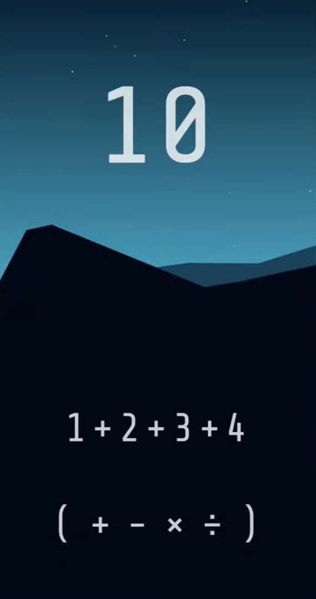

# mobile-game-hack-4equals10

This project is designed to crack a mobile game named "4=10" ([official website](https://fourequalsten.app/)). In this game, you get 4 numbers and some usable operators in each stage. And the goal is to make the result equal 10 with those given operators which is not always contains all of the "＋", "－", "×", "÷". 

 ㅤ

  
  
   
  <em>▲ The stage is clear in the left case and not clear in the right one ▲</em>
   

### :star: If this project is helpful to you, please help star this repo. Thanks! :hugs:
 ㅤ
## How to Use?
##### :warning: Parameters IN a cell must be set before running the cell, whereas those BELOW a cell don't. :warning:

 ㅤ
 
1. Run cell group `Imports & Functions` & `Preprocessing`

 ㅤ

2. Go into cell group `Main` to select mode and set X & Y

 ㅤ
 
3. 
