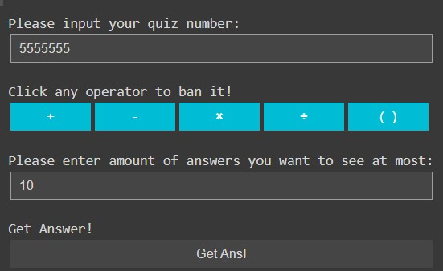
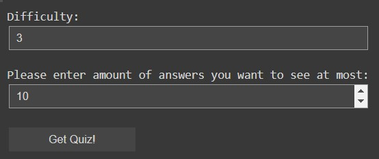
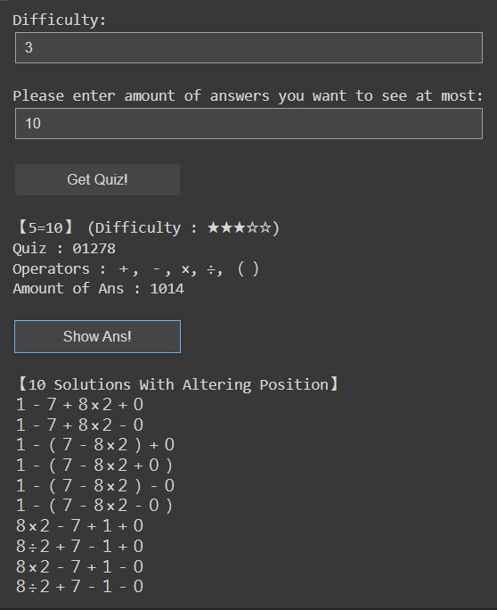
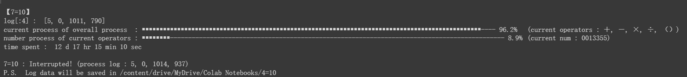

# mobile-game-hack-4equals10

This project is designed to crack a mobile game named "4=10" ([official website](https://fourequalsten.app/)). In this game, you get 4 numbers and some usable operators in each stage. And the goal is to make the result equal 10 with those given operators which do not always contain all of the "＋", "－", "×", "÷". 

 ㅤ

  
  
   
  <em>▲ The stage is clear in the left case and not clear in the right one ▲</em>
   

### :star: If this project is helpful to you, please help star this repo. Thanks! :hugs:
 ㅤ
## How to Use?
##### :warning: Parameters IN a cell must be set before running the cell, whereas those BELOW a cell don't. :warning:

 ㅤ
 
1. Run cell group `Imports & Functions` & `Preprocessing`

 ㅤ

2. Go into cell group `Main` and select mode as well as set X&Y, where X&Y means "X=Y". X is 4 and Y is 10 in most of condition, just like the name of this game~. But if you wanna try something cool, you can set X&Y as different number. e.g. 5=10, 4=100, 5=87...etc. BTW, the following are the modes able to select:
 
 

 
| mode | Function |
|---|---|
| Get Ans | Get answers of X=Y |
| Get Quiz | Get quizzes of X=Y in various difficulty |
| Grid Search | Generate unprecedented quizzes data |

 ㅤ
 
:bell: Don't forget to run this cell after selecting & setting.

 ㅤ

3. Run the cell of the mode you select only or all of the rest cells. 

    ㅤ

   - **If you choose the mode "Get Ans":**
  
      After running the cell `Mode "Get Ans"`, some widgets will be displayed. Then input the quiz number and click banned operators. Finally get the answer of X=Y by clicking the **Get Ans!** button. BTW, you can change the amount of answers you want to see at most if you wanna get more or fewer answers.

    ㅤ  
   

   
    
   <em>▲ Socalled "some widgets" ▲</em>
    
   

          ㅤ

   - **If you choose the mode "Get Quiz":**
  
      After running the cell `Mode "Get Quiz"`, some widgets will be displayed. Then select the difficulty from 1~5. Finally get the quiz of X=Y by clicking the **Get Quiz!** button. BTW, you can change the amount of answers you want to see at most if you wanna get more or fewer answers.

   

   
    
   <em>▲ Socalled "some widgets" ▲</em>
    
   

    ㅤ    ㅤ
   

   
    
   <em>▲ You can get answer as well after getting quiz by clicking the "Show Ans!" button.  ▲</em>
    
   

     ㅤ

      :bell: You can change the quizzes data source by editing `quizzes_data` in this cell if you have another one.

     ㅤ

   - **If you choose the mode "Grid Search":**
  
      After executing `Mode "Grid Search"`, you can generate your own unprecedented quizzes data with X=Y values. The process can be quite time-consuming if X exceeds 5, but this shouldn't be a major issue as the progress will be displayed in real-time during the run and saved as a pickle file in your Google Drive each time you stop running the cell. At the end of the job, a CSV file named X=Y.csv (where X and Y are numbers you previously set) will also be generated and saved in your Google Drive.

      Additionally, you're able to change the folder where your pickle and CSV files are stored by adjusting the `log_folder` and `output_folder` parameters in this cell. Moreover, you can enable LINE notifications to keep track of the progress of the grid search by entering your LINE notify API token into the `line_notify_api_token` parameter in this cell. If you prefer not to expose your LINE notify API token publicly when running this project externally, you can modify the `line_notify_api_token_path` parameter with the path to a text file containing your token in your Google Drive, which can also be read.
      
      ㅤ 
    

   
    
   <em>▲ UI of Mode "Grid Search" ▲</em>
    
   

 ㅤ
      
## FAQ

 ㅤ
 
:question: FileNotFound error occurs in Mode "Grid Search", how to solve it?

:bulb: Maybe it's a bug in Google Drive and I have no idea why it happens, either. But don't worry because it still works, which means the log data will not disappear but be found next time. What you only need to do is running again to continue.

 ㅤ
 
:question: May I share the quizzes data with others by giving them toward the author to add them into this repository?

:bulb: Sure! Just send mail to pikasxyz@gmail.com in detail~

 ㅤ
 
:question: Something different from the above.

:bulb: Send mail to pikasxyz@gmail.com and explain in detail.
